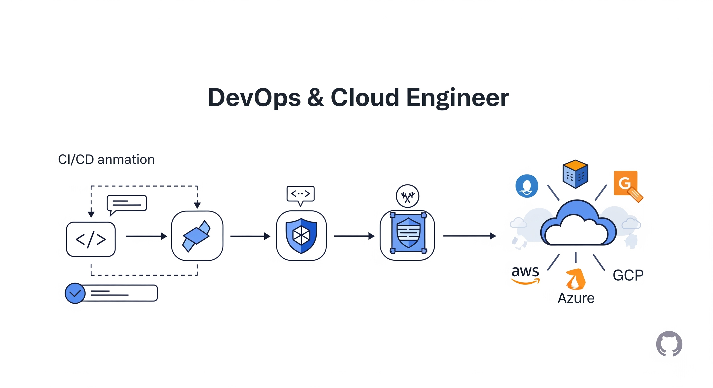

# Hi there, I'm Vikas Hegde 👋

  

  
  
  
  
  
  
  

---

## 🚀 About Me

- 🔭 I'm currently working on **devops_github**
- 🌱 I'm currently learning **golang**
- 👯 I'm looking to collaborate on **Open Source Projects**
- 💬 Ask me about **Python, AWS, docker , kubernetes**
- 📫 How to reach me: **vikashegde213@gmail.com**
- ⚡ Fun fact: **I write code that even my computer laughs at. If bugs were currency, I'd be a billionaire!**
- 🏄‍♂️ **Now:** Building cool stuff, breaking things, and fixing them again!

## 🖼️ Banner

  

## 🛠️ Tech Stack

### Languages

### Backend

### Database

### Cloud & DevOps

## 📊 GitHub Stats

  
  
  

## 🏆 GitHub Trophies

  

## 📈 Activity Graph

  

## 🎯 Featured Projects

## 🐍 Contribution Snake

  

---

## 📬 Connect with Me

  
  
  

---

  **"Code is like humor. When you have to explain it, it's bad." – Cory House**
  
  _More updates coming soon!_

